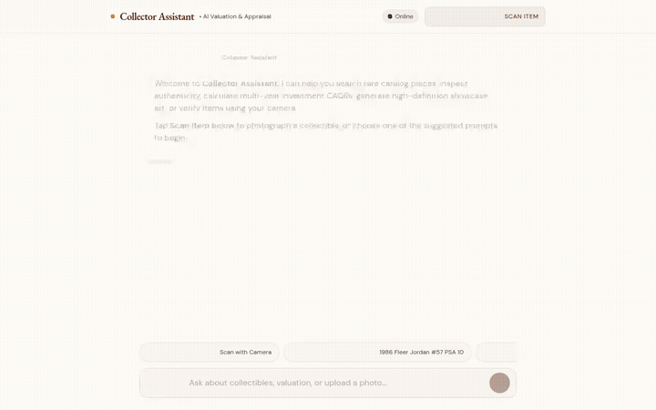

# Collector Assistant 🏺

> An intelligent marketplace curator and appraisal agent for rare collectibles, built with Google's Agent Development Kit (ADK), Gemini 3.6 Flash, and Agent Platform.



---

## Overview

**Collector Assistant** is an agent designed for collectors, auctioneers, and enthusiasts in rare marketplace categories (trading cards, sneakers, vintage watches, retro video games, and vinyl records). 

The agent connects real-time database catalog queries, AI appraisal estimates, studio media generation, geolocation services, and safe Python financial modeling inside an Agent Engine sandbox.

---

## What the Agent Actually Does

Based on the codebase in `app/` and `agents-cli-manifest.yaml`, the agent provides the following implemented capabilities:

### 1. 🗄️ Google Cloud Firestore Catalog Management
* **`search_collectibles`**: Queries items in the Firestore `collectibles` collection by keyword, category, or maximum price.
* **`get_collectible_details`**: Retrieves full catalog metadata, condition grades, rarity notes, and provenance.
* **`add_collectible`**: Lists a new collectible into the Firestore collection with automated slug generation and timestamping.
* **`update_collectible_status`**: Modifies listing availability status (`available`, `reserved`, `sold`).

### 2. 🏷️ Market Value Appraisals
* **`estimate_market_value`**: Evaluates condition tiers (Pristine/Gem Mint, Mint, Near Mint, Very Good, Fair) against comparable sales baseline data in Firestore to compute estimated fair market values and low/high confidence ranges.

### 3. 🎨 AI Media Generation (Google Cloud Storage & ADK Artifacts)
* **Showcase Image Generation (`generate_collectible_image`)**:
  * Uses **`gemini-3.1-flash-lite-image`** in the `global` region.
  * Generates studio showcase visuals of rare items (e.g., PSA/BGS slabs, vintage watches).
  * Saves image bytes directly to **Google Cloud Storage (GCS)** and registers session artifacts via `tool_context.save_artifact` for the ADK Playground Artifacts panel.
* **Showcase Video Generation (`generate_collectible_video`)**:
  * Uses Google's Omni model **`gemini-omni-flash-preview`** in the `global` region via the Interactions API.
  * Creates cinematic rotating turntable display videos.
  * Directly uploads video bytes to Cloud Storage and saves as ADK session artifacts without writing temporary local files.

### 4. 🧮 Agent Platform Python Code Sandbox
* **`execute_python_in_sandbox`**: Uses `AgentEngineSandboxCodeExecutor` to run arbitrary Python code in an isolated Vertex AI Agent Engine sandbox environment.
* Computes Compound Annual Growth Rates (CAGR), portfolio valuations, profit/loss returns, and inflation adjustments.

### 5. 📍 Google Maps Geolocation & Nearby Places
* **`geocode_address`**: Converts addresses or landmark names into latitude/longitude coordinates via the Geocoding API.
* **`find_nearby_places`**: Discovers local hobby shops, card stores, and antique galleries within a specified radius using the Google Places API (New).

### 6. 💬 Web Chat Frontend & A2UI Renderer
* **FastAPI Proxy (`frontend/main.py`)**: Bridges browser requests to the deployed agent using the Agent-to-Agent (A2A) protocol.
* **Interactive Chat UI (`frontend/static/index.html`)**: Features an antique collector theme, avatar dialog layout, interactive suggested prompt chips, and a lightweight **A2UI v0.8 renderer** supporting Cards, Columns, Rows, Text, Images, Dividers, and Material Symbols icons.

---

## Status of Planned Features

| Feature | Status | Notes |
| :--- | :--- | :--- |
| **Firestore Marketplace Catalog** | ✅ Implemented | Live in `app/agent.py` |
| **GCS Image & Video Uploads** | ✅ Implemented | Public HTTPS URLs returned |
| **Agent Engine Code Sandbox** | ✅ Implemented | Live via `AgentEngineSandboxCodeExecutor` |
| **Google Maps / Places API** | ✅ Implemented | Live via `geocode_address` & `find_nearby_places` |
| **A2A Protocol & Chat Web UI** | ✅ Implemented | FastAPI proxy + A2UI v0.8 renderer |
| **Cross-Session Memory Bank** | ⏳ Planned, not yet implemented | Currently uses per-conversation context IDs via A2A; long-term cross-session Memory Bank is planned for a future release |

---

## Project Structure

```
collector-assistant/
├── app/
│   ├── agent.py               # Root ADK agent, tools, models, and sandbox wiring
│   ├── fast_api_app.py        # Agent API application
│   └── app_utils/             # A2A adapters and services
├── frontend/
│   ├── main.py                # FastAPI proxy server (browser -> agent via A2A)
│   ├── requirements.txt       # Frontend dependencies
│   ├── Dockerfile             # Container build for Cloud Run
│   └── static/
│       └── index.html         # Dialogue UI with antique theme & A2UI renderer
├── demo.gif                   # Looping walkthrough recording
├── seed_firestore.py          # Script to populate sample collectible catalog items
├── agents-cli-manifest.yaml   # Agent deployment manifest
└── pyproject.toml             # Python dependencies and metadata
```

---

## Setup & Local Development

### 1. Prerequisites
* Python 3.10+
* Google Cloud SDK (`gcloud`) authenticated to your Google Cloud project
* Application Default Credentials:
  ```bash
  gcloud auth application-default login
  ```

### 2. Install Agent Dependencies
Navigate into the agent directory and install dependencies:
```bash
cd collector-assistant
python3 -m venv .venv
source .venv/bin/activate
pip install -e .
```

### 3. Configure Environment Variables
Create a `.env` file in the `collector-assistant` directory:
```bash
GOOGLE_MAPS_API_KEY="<your-google-maps-api-key>"
```

### 4. Seed the Database
Populate the Firestore catalog with initial collectible records:
```bash
python seed_firestore.py
```

### 5. Run the Agent Locally

**Via the agents-cli Terminal:**
```bash
agents-cli run "Show rare trading cards in the catalog"
```

**Via the ADK Web Playground:**
```bash
agents-cli playground
```

### 6. Run the Chat Frontend Locally
In a separate terminal, start the FastAPI chat proxy:
```bash
cd frontend
python3 -m venv .venv
source .venv/bin/activate
pip install -r requirements.txt

export AGENT_ENGINE_RESOURCE_NAME="<your-agent-engine-resource-name>"
export AGENT_DIRECTORY="app"

python main.py
```
Open a browser to port `8080` on your machine.
